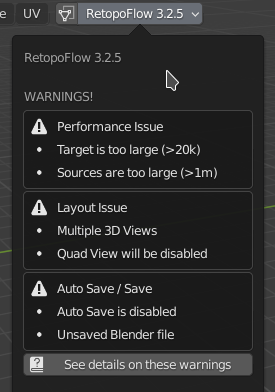

# RetopoFlow Warnings

RetopoFlow might present a warning if it detects a situation which is not ideal to start in.

## Setup: Source / Target Meshes

RetopoFlow requires at least source mesh to start.
A source mesh can be any visible mesh that is not being edited.

RetopoFlow assumes that the edited mesh is the target mesh.
If the edited mesh is not visible, RetopoFlow cannot start.

See [Quick Start Guide](quick_start.md) for more details.

## Setup: Non-Invertible Matrix

RetopoFlow is designed to work with sources and targets that have invertible transformation matrices.
RetopoFlow will warn if a source object or the target object has a transformation matrix that is not invertible (ex: one of the scale transform values is near 0).

While RetopoFlow will still start and operate when an object has a non-invertible matrix, the results and behaviors are undefined.

## Performance: Target/Sources Too Large

RetopoFlow is designed to perform well on _typical_ production retopology scenarios.
Running RetopoFlow on source/target meshes beyond a reasonable range is possible, but it will result in slower performance and a poorer experience.

A typical retopology workflow would involve <{{ site.data.options.warning_max_sources }} polygons in total for all source meshes and <{{ site.data.options.warning_max_target }} polygons for the target mesh.
Beyond these counts is the point at which Blender starts to slow down, and there's not a lot we can do to be faster than Blender itself.

If your retopology target polygon count exceeds the {{ site.data.options.warning_max_target }} count threshold, please try the following:

- Capture the surface details using a normal or a bump map instead of through geometry
- Use a Subdivision Surface modifier to smooth the mesh rather than additional edge loops
- Use the Mirror modifier and only retopologize half of the source

If your total source mesh(es) polygon count exceeds the {{ site.data.options.warning_max_sources }} count threshold, try the following:

- Use a Decimate or Remesh modifier to reduce the overall count.
- Create a decimated copy of your source mesh and retopologize the copy. As long as it doesn't noticibly impact the silhouette of the object, decimation won't affect the resulting retopology at all
- Disable any Subdivision Surface modifiers or lower the Multiresolution Modifier display level
- Segment your sources into separate parts and retopologize one at a time
- Work in a .blend file that links in the large source meshes.  This may not improve the speed of editing, but it will improve (auto-)save times.

## Layout: Quad View / Multiple 3D Views

RetopoFlow is designed to work in a single 3D view.
Running RetopoFlow with Quad View turned on or with multiple 3D Views can result in RetopoFlow showing up in every 3D View, but only allowing interaction in one.

## Layout: Locked View

If either Lock to Object or Lock to 3D View are enabled, navigating in RetopoFlow can be incorrect.
Disable either of these settings in the 3D View Sidebar (`N`) before starting RetopoFlow.

## Auto Save / Save

If Blender's auto save is disabled, any work done since the last time you saved can be lost if Blender crashes. To enable auto save, go Edit > Preferences > Save & Load > Auto Save.

If you are working on an unsaved blend file, your changes will be saved to a temporary file (see path below) when you press {{ site.data.keymaps.blender_save }}.

Temporary file path: `{`options.get_auto_save_filepath()`}`

If you directly open an auto saved file, some of the visual settings and mesh sizes will be different.
Clicking the "Finish Auto Save Recovery" button will recover the original visual settings and mesh sizes.

## Installation

Parts of RetopoFlow can fail if the add-on folder name contains letters that are not alphanumeric character (i.e., `a-z`, `A-Z`, `0-9`).
This happens when RetopoFlow is installed from a zip file that was not packaged correctly.

In particular, the zip file created by GitHub (either Code > Download Zip or Releases > Download Source) will use folder names with invalid characters, usually a dash.

Our recommended solution is to uninstall the unofficially packaged RetopoFlow and then install an officially packaged RetopoFlow from Blender Market.

## Inverted Normals

If a source mesh is detected to have inward facing normals, RetopoFlow will report a warning.
Inward facing normals will cause new geometry to be created incorrectly or to prevent it from being selected.

Possible fix: exit RetopoFlow, switch to Edit Mode on the source mesh, recalculate normals, then try RetopoFlow again.

